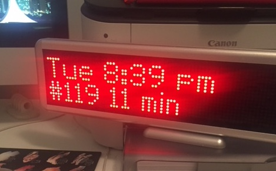

# NJTsign v2.01
=======
Oct 2018 
Anthony Townsend (anthony@bitsandatoms.net)



## Description

A Python app to grab real-time bus arrival predictions from NJTransit.com BusTime app and push them to a brightledsigns.com display via USB serial cable. Now fully object-oriented implementation.

## Minimum Hardware
- Raspberry Pi (should run ok on a 0, 2 or 3)
- LED sign ['Mini' 16 by 96 pixel sign](https://brightledsigns.com/programmable/indoor/bs-4x16-mini) from BrightLedSigns.com. If tehy are sold out, AliExpress carries  [the same model](https://www.aliexpress.com/item/16x96Matrix-Led-desktop-display-red-color-LED-dot-matrix-signs-indoor-LED-moving-message-display-led/32522881975.html). 

## Hardware
All in, you can build this for about $160 including shipping if you are smart.
1. Pi - I use a Pi 2 B, and its more than fast enough ([$35](https://www.canakit.com/raspberry-pi-2.html?cid=usd&src=raspberrypi) from CanaKit). I think it will work on a Zero but hasn't been tested. A 3 is probably overkill.
2. Case and power supply. You'll need a case for the Pi and at least 2000mA power supply, prefrerably more as you'll be powering the LED over its USB data cable as well. About $10 for each.
3. Screen - You want the 4 x 16 LED Mini Desk Sign[$90](https://brightledsigns.com/programmable/indoor/bs-4x16-mini) from BrightLEDSigns.com. (Update - BrightLedSigns is out of stock but points out that AliExpress still carries what appears to be [the same model](https://www.aliexpress.com/item/16x96Matrix-Led-desktop-display-red-color-LED-dot-matrix-signs-indoor-LED-moving-message-display-led/32522881975.html). We ordered one on 1 Sept 2018 for evaluation).
4. Wifi Dongle - Any of the $10-15 USB WiFi stubs for the Pi should work.


## Usage

```python
python njtsign.py {stop_id1,route_id1} {stop_id2,route_id2} ... [-h] [-w]
    -h      Display help
    -w      Write to sign (otherwise only render message as test)

```

## Future Features
- Command line switch to retrieve display config (route/stop pairs) as JSON from web controller API, and fallback to command line args if cannot connect.


## Implementation

As of v2.0 (about Oct 29 2018) is now fully Python 3, object-oriented code.

#### Classes

- Service
- Slide
- FontSimple

#### Dependencies

- pyledsign: I've bundled this code into the project since its stable for 2 years now. [github](https://github.com/BrightLedSigns/pyledsign)

#### Data Sources
Arrival times are pulled from the NJTransit API, run by Clever Devices.

```html
http://mybusnow.njtransit.com/bustime/eta/getStopPredictionsETA.jsp?route=all&stop=30189
```

#### Automation

The program as coded only runs a single 1-minute loop. Ideally you want to run it every minute as a cron job. Here are some of the ways I use it near my intersection in Jersey City Heights, where my family uses multiple bus routes on a daily basis to get to various destinations.

```
# just 119
# * * * * * cd /home/pi/njtsign && python2 njtsign.py 30189,119 -w

# just webster ave 119 and 85
# * * * * * cd /home/pi/njtsign && python njtsign.py 30189,119 30189,85 -w

# 4 routes from the heights - nyc 119,123 hob term 85,87
# * * * * * cd /home/pi/njtsign && python njtsign.py 30189,119 21062,123 30189,$

# 119,85,119 and 87 - double cycle 119
# * * * * * cd /home/pi/njtsign && python njtsign.py 30189,119 30189,85 30189,1$

# fast cycle 10 seconds with focus on 119 -- 119,85,119,87,119,86P
* * * * * cd /home/pi/njtsign && python njtsign.py 30189,119 30189,85 30189,119 21062,87 30189,119 21065,86 -w
```

## Development

As of [this commit](https://github.com/anthonymobile/njtsign/commit/ac4694b5dbfc15693f858e8efdae78e9933b983f) the master branch codebase is working pretty solid as best I can tell. However, I am working on a rewrite that refactors most of the messy script as classes and is considerably faster and should provide generic resuable code for rendering the 2-line 8-pixel fonts on the BrightLedSigns Mini sign. It's here on the [oop-refactor branch](https://github.com/anthonymobile/njtsign/tree/oop-refactor).

Things I'd like to add:
- Weather. Most of the code is in there, just needs to be debugged
- Headsign display. This would be part of a customizable display for the first line. The data is in the API response it just needs to be formatted in a smart way and handled per previous bullet in a way that doesn't bork the screen.
- ([fixed as of commit f7a9ea5](https://github.com/anthonymobile/njtsign/commit/f7a9ea56208e077e1352eb564c3fec00c6462463#diff-502317879204e7ff8e75decdfaac7fbb) - display now limited to next 2 arrivals) Trap for lines that are too long. If there's too much text, and the bitmap is bigger than 96 pixels long, the sign simply won't take it and writing will fail. Usually, as the sign cycles, it will recover on the next service, but the one that failed will continue. Usually the culprit is 3 or more inbound buses, which, thanks to current budgets is extremely rare. There just aren't many routes in the state with that kind of frequency.

## Hudson County Support for Public Displays

If you are in Jersey City, Hoboken, Bayonne, or other Hudson County communities, I'm happy to meet and help you setup one of these for yourself if you display it in a public place like a store, school, church, or your own window, etc. Ping me here on github or njtsign at bitsandatoms dot net.
